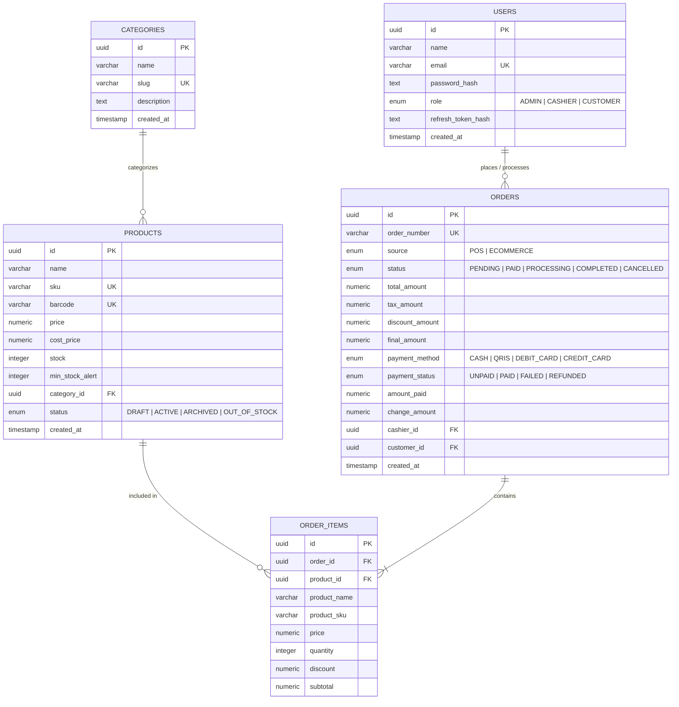

# Architecture & Technical Design Document

This document provides a comprehensive technical overview of the **AuraPOS & Mini E-Commerce** platform.

---

## 1. High-Level Architecture

The system is structured as an **npm monorepo** with clear boundary separation between the presentation layer, the business/orchestration layer, and data persistence services.

```mermaid
flowchart TD
    subgraph Client Layer (apps/web)
        RSC[Next.js 15 React Server Components]
        CC[Interactive Client Components: POS Terminal, Live Cart]
    end

    subgraph API Gateway & Service Layer (apps/api)
        REST[NestJS REST API Gateway]
        GQL[GraphQL Engine / Apollo Server]
        Auth[JWT & RBAC Guards]
        Drizzle[Drizzle ORM Engine]
        Queues[BullMQ Job Producer]
        Workers[BullMQ Workers / Processors]
    end

    subgraph Data & Cache Tier
        PG[(PostgreSQL 16 Database)]
        Redis[(Redis 7 In-Memory Cache & Message Broker)]
    end

    RSC -->|REST / GraphQL| REST
    CC -->|REST: Checkout / Auth| REST
    CC -->|GraphQL: Read-heavy Catalog| GQL
    
    REST --> Auth
    GQL --> Auth
    
    REST --> Drizzle
    GQL --> Drizzle
    
    GQL <-->|Query Cache| Redis
    Drizzle --> PG
    
    REST --> Queues
    Queues --> Redis
    Redis --> Workers
```

---

## 2. API Design Strategy: Dual API Approach

To maximize throughput and developer ergonomics, the backend implements a **Dual API Pattern**:

1. **REST API (`/api/*`)**:
   - Ideal for transactional, write-heavy operations.
   - Used for: Authentication (`/api/auth/*`), POS rapid checkout (`/api/pos/checkout`), Order management (`/api/orders/*`), User RBAC administration (`/api/users/*`), and Inventory management.
   - Fully documented with OpenAPI / Swagger at `/api/docs`.

2. **GraphQL API (`/graphql`)**:
   - Optimized for read-heavy catalog exploration and flexible query shapes without over-fetching.
   - Queries:
     - `catalogProducts(categoryId, search)`
     - `catalogCategories`
     - `productBySku(sku)`
   - Integrated with Redis caching layer for near-zero latency catalog responses.

---

## 3. Database Schema (PostgreSQL & Drizzle ORM)

### Entity Relationship Diagram



---

## 4. Role-Based Access Control (RBAC) Matrix

| Resource / Endpoint | `ADMIN` | `CASHIER` | `CUSTOMER` | Public (Unauthenticated) |
| :--- | :---: | :---: | :---: | :---: |
| `POST /api/auth/register` | ✅ | ✅ | ✅ | ✅ |
| `POST /api/auth/login` | ✅ | ✅ | ✅ | ✅ |
| `GET /api/catalog` & GraphQL | ✅ | ✅ | ✅ | ✅ |
| `POST /api/pos/checkout` | ✅ | ✅ | ❌ | ❌ |
| `GET /api/orders/dashboard/metrics` | ✅ | ❌ | ❌ | ❌ |
| `POST /api/products` (Create/Delete) | ✅ | ❌ | ❌ | ❌ |
| `PATCH /api/products/:id` (Stock/Price) | ✅ | ✅ | ❌ | ❌ |
| `PATCH /api/users/:id/role` | ✅ | ❌ | ❌ | ❌ |
| `POST /api/orders` (Online Checkout) | ✅ | ✅ | ✅ | ❌ |

---

## 5. Background Jobs Architecture (BullMQ + Redis)

Background processing handles CPU-heavy or asynchronous side-effects without blocking synchronous HTTP responses:

1. **`receipt-queue`**:
   - Triggered immediately when a POS or online checkout completes.
   - Generates digital invoice PDF and dispatches confirmation emails/webhooks.
2. **`stock-alert-queue`**:
   - Triggered when product stock falls below the configured `minStockAlert` threshold.
   - Pushes notifications to store managers and admin alert feeds.

---

## 6. Anti-Slop Principles Applied

- **No AI placeholders or mock lorem-ipsum**: All seed data contains realistic artisan products, SKUs, barcodes, and business scenarios.
- **Strict, End-to-End Type Safety**: Shared domain models between backend and frontend via `@mini-pos/shared`.
- **Lively, Non-Sterile Design Language**: Curated dark palette with emerald accents, glassmorphic panels, glowing focus states, and responsive layouts.
- **Fail-Safe Fallbacks**: Frontend components gracefully degrade with optimistic mock data when offline or during initial startup.
